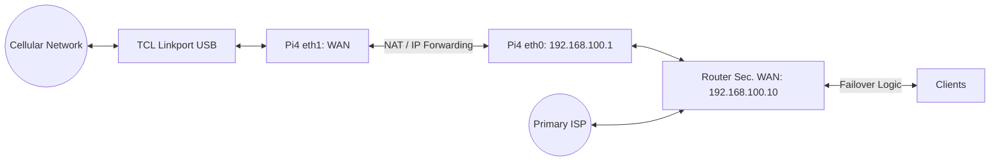

# Raspberry Pi Configuration

A step-by-step guide to turn a Raspberry Pi and a USB LTE modem into a secondary WAN for your router in Failover mode.

## Topology & Architecture

!!! info "Network Flow"

    - **Cellular Network** ↔ TCL Linkport (USB) ↔ Pi4 (`eth1` = WAN)
    - **Pi4 LAN Uplink** (`eth0` = LAN/Router uplink, 192.168.100.1/24)
    - **Routing Logic:** Pi acts as a NAT (iptables MASQUERADE) with IP forwarding enabled.
    - **Router Logic:** Secondary WAN is set to Static IP `192.168.100.10` (Gateway: `192.168.100.1`).



---

## Streamlined Package Installation

Install the core networking tools required for the bridge.

```bash title="Install core networking tools"
sudo apt update && sudo apt install -y \
iptables \
iptables-persistent \
netfilter-persistent \
ethtool \
tcpdump \
networkd-dispatcher
```

!!! tip "Package Explanations"

    - `iptables`: Firewall rules for NAT and security.
    - `iptables-persistent`: Persist iptables rules across reboots.
    - `netfilter-persistent`: Persist netfilter rules across reboots.
    - `ethtool`: View or tune link parameters.
    - `tcpdump`: Traffic verification and debugging.
    - `networkd-dispatcher`: Hooks to run link-tuning commands at boot.

---

## Interface Pinning & Network Configuration

USB modems can sometimes enumerate under new names (e.g., `usb0`) after a reboot. We lock them down using `udev` rules, then configure the IPs explicitly.

### Pin MAC Addresses

1. Run `ip link show` and note the MAC addresses for your built-in Ethernet and your USB modem.

2. Create the `udev` rules:

    ```bash title="Create udev rules"
    sudo nano /etc/udev/rules.d/70-persistent-net.rules
    ```

3. Add the following lines to the file:

    ```text title="/etc/udev/rules.d/70-persistent-net.rules"
    SUBSYSTEM=="net", ACTION=="add", DRIVERS=="?*", ATTR{address}=="XX:XX:XX:XX:XX:XX", NAME="eth0"
    SUBSYSTEM=="net", ACTION=="add", DRIVERS=="?*", ATTR{address}=="YY:YY:YY:YY:YY:YY", NAME="eth1"
    ```

    !!! note "Make sure to replace the XX and YY placeholders with your actual MAC addresses!"

### Assign IPs & MTU (NetworkManager)

Create profiles for both interfaces. This assigns a static IP to `eth0` and tells `eth1` to fetch its IP dynamically from the modem while locking the MTU to `1420` to prevent cellular packet drops.

```bash title="Configure NetworkManager Profiles"
# 1. Set Pi's LAN/Uplink on eth0 (Static)
sudo nmcli connection add type ethernet ifname eth0 con-name "eth0-static" ipv4.addresses 192.168.100.1/24 ipv4.method manual
sudo nmcli connection up "eth0-static"

# 2. Set LTE/WAN on eth1 (DHCP + MTU 1420)
sudo nmcli connection add type ethernet ifname eth1 con-name "eth1-lte" ipv4.method auto 802-3-ethernet.mtu 1420
sudo nmcli connection up "eth1-lte"
```

!!! tip "NetworkManager Profiles"

    - `eth0-static`: Static IP for the Pi's LAN/Uplink.
    - `eth1-lte`: Dynamic IP for the LTE/WAN, with MTU locked to `1420`.

Clean up any overlapping profiles:

1. List all profiles:

    ```bash title="List all profiles"
    sudo nmcli connection show
    ```

2. Delete any overlapping profiles:

    ```bash title="Clean up default overlapping profiles"
    sudo nmcli connection delete "profile to delete"
    ```

---

## Enable Kernel IPv4 Forwarding

Forwarding allows packets arriving from the router on `eth0` to be routed out to the LTE network on `eth1` and back.

```bash title="Enable & persist forwarding"
# Enable immediately
sudo sysctl -w net.ipv4.ip_forward=1

# Persist across reboots
echo "net.ipv4.ip_forward = 1" | sudo tee /etc/sysctl.d/99-ipforward.conf
sudo sysctl -p /etc/sysctl.d/99-ipforward.conf
```

---

## Add NAT & Security Hardening (iptables)

This configuration flushes existing rules, rewrites private LAN IPs to the Pi's LTE source IP, adds MSS clamping to fix cellular MTU quirks, and introduces new `INPUT` drops to secure the Pi from direct external access over the cellular network.

```bash title="Configure iptables"
# Clear existing rules to ensure a clean slate
sudo iptables -F
sudo iptables -t nat -F
sudo iptables -t mangle -F

# NAT: rewrite LAN -> WAN source IPs
sudo iptables -t nat -A POSTROUTING -o eth1 -j MASQUERADE

# Forwarding policy: allow router -> LTE, and return traffic back
sudo iptables -A FORWARD -i eth0 -o eth1 -j ACCEPT
sudo iptables -A FORWARD -i eth1 -o eth0 -m state --state RELATED,ESTABLISHED -j ACCEPT

# MSS clamping: adjust TCP MSS to path MTU
sudo iptables -t mangle -A FORWARD -o eth1 -p tcp --tcp-flags SYN,RST SYN -j TCPMSS --clamp-mss-to-pmtu

# Security Hardening: Drop unsolicited traffic hitting the Pi directly from LTE
sudo iptables -A INPUT -i eth1 -m state --state RELATED,ESTABLISHED -j ACCEPT
sudo iptables -A INPUT -i eth1 -j DROP

# Save rules persistently
sudo netfilter-persistent save
sudo systemctl enable netfilter-persistent
```

---

## Validation & Testing

To test failover:

1. Reboot both the Pi and your router to ensure a clean state.
2. Unplug the Primary WAN.
3. Wait 30–90 seconds and verify your router's Secondary WAN shows as **Connected** (see [Router Configuration](router.md) for details).

You can monitor the Pi's NAT translation live by running:

```bash title="Monitor NAT Traffic"
sudo watch -n 1 "iptables -t nat -nvL POSTROUTING"
```

_(The packet and byte counters for `MASQUERADE` should steadily increase as clients browse)._

Re-plug the Primary WAN to confirm the router successfully fails back to it after 30–60 seconds.

---

## Optimization & Power Saving (Optional)

Since this Pi acts exclusively as a wired bridge, you can disable the onboard Wi-Fi and Bluetooth to reduce power consumption and heat.

1. Open the boot configuration file:
    ```bash
    sudo nano /boot/firmware/config.txt
    ```
2. Scroll to the bottom and append these lines:
    ```text
    dtoverlay=disable-wifi
    dtoverlay=disable-bt
    ```
3. Save, exit, and reboot.

---

## Troubleshooting

??? question "USB modem not detected"

    Run the following to check if the system sees the USB device:

    ```bash
        lsusb
        dmesg | grep -i usb
        ```

    If the modem does not appear, try a different USB port or cable. Some modems require a specific mode switch (e.g., `usb_modeswitch`) to present as a network device instead of a storage device.

??? question "`eth1` not getting an IP from the modem"

    Verify the modem is in tethering/hotspot mode, then check:

    ```bash
    sudo nmcli connection up "eth1-lte"
    ip addr show eth1
    ```

    If no IP appears, try releasing and renewing DHCP manually:

    ```bash
    sudo dhclient -r eth1 && sudo dhclient eth1
    ```

??? question "NAT counters not incrementing"

    If `MASQUERADE` packet counts stay at zero when clients are browsing:

    ```bash
    sudo iptables -t nat -nvL POSTROUTING
    ```

    Verify that IP forwarding is enabled (`sysctl net.ipv4.ip_forward` should return `1`) and that the FORWARD chain rules are present (`sudo iptables -L FORWARD -v`).

??? question "Router health checks failing"

    Ensure the Pi can reach the internet from the LTE interface:

    ```bash
    ping -I eth1 8.8.4.4
    ```

    If this fails, the issue is between the modem and the cellular network (verify signal, SIM, data plan). If it succeeds, double-check the router's secondary WAN static IP settings match the Pi's `eth0` subnet (`192.168.100.x`).
